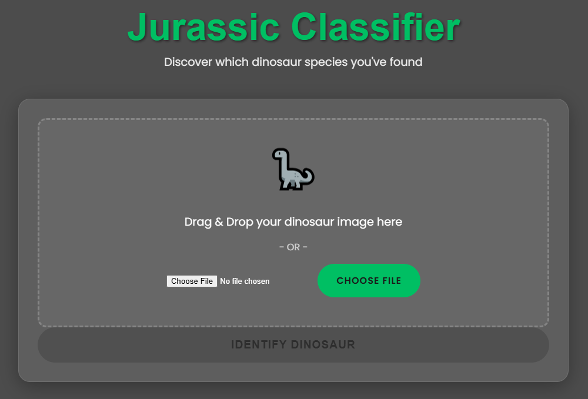

# 🦖 Jurassic Classifier

A deep learning web application that identifies dinosaur species from images using an ensemble of convolutional neural networks.

## 🌟 Features

- Upload images via drag & drop or file selection
- Real-time image preview
- Identifies 15 different dinosaur species
- Modern, responsive UI with a Jurassic theme
- Ensemble model prediction for improved accuracy

## 🦕 Supported Dinosaur Species

- Tyrannosaurus Rex
- Gallimimus
- Parasaurolophus
- Microceratus
- Spinosaurus
- Triceratops
- Velociraptor
- Pachycephalosaurus
- Dilophosaurus
- Stegosaurus
- Compsognathus
- Ankylosaurus
- Dimorphodon
- Corythosaurus
- Brachiosaurus

## 🛠️ Technology Stack

- **Frontend**: HTML, CSS, JavaScript
- **Backend**: Flask
- **Machine Learning**: TensorFlow, Keras
- **Data Processing**: Pandas, NumPy, Pillow

## 📋 Prerequisites

- Python 3.8+
- pip package manager

## ⚙️ Installation

1. Clone the repository:
    ```bash
    git clone https://github.com/yourusername/jurassic-classifier.git
    cd jurassic-classifier
    ```

2. Install required packages:
    ```bash
    pip install flask tensorflow pandas numpy pillow
    pip install -r requirements.txt
    ```

3. Download the model files:
   - Ensure you have the `ensemble_model_0.h5`, `ensemble_model_1.h5`, and `ensemble_model_2.h5` files in your project directory.
   - Due to the size of the file, please contact petershamoun80@gmail.com to get access to dino_pics.pkl. However, the app can be run without the pkl and just with app.py, dino.py, and the ensemble models. The pkl is just used fro the model creation
## 🚀 Running the Application

1. Start the Flask server:
    ```bash
    python app.py
    ```

2. Open your web browser and navigate to:
    ```
    http://localhost:5000
    ```

## 📁 Project Structure

jurassic-classifier/
- app.py  # Flask application
- dino.py  # Model prediction logic
- model.py  # Model training code
- get_pkl.py  # Code for getting the dino pkl based on pics, redundant given pkl.
- dino_pics.pkl  # All normalized and standardized dino images
- static/
  - style.css  # Styling
  - script.js  # Frontend logic
  - dino-bg.jpg  # Background image
- templates/
  - index.html  # Main page
- ensemble_model_1.h5  # Trained model
- ensemble_model_2.h5  # Trained model
- ensemble_model_3.h5  # Trained model


## 🤖 Model Architecture

The project uses an ensemble of 3 CNN models with the following architecture:

```python
def create_model(input_shape):
    model = Sequential()
    model.add(Conv2D(filters=128, kernel_size=(11,11), strides=(8,8), activation='relu', input_shape=input_shape))
    model.add(BatchNormalization())
    model.add(MaxPooling2D((2, 2)))
    model.add(Conv2D(filters=256, kernel_size=(5,5), strides=(1,1), activation='relu', padding="same"))
    model.add(BatchNormalization())
    model.add(MaxPooling2D(pool_size=(3,3)))
    model.add(Conv2D(filters=256, kernel_size=(3,3), strides=(1,1), activation='relu', padding="same"))
    model.add(BatchNormalization())
    model.add(Conv2D(filters=256, kernel_size=(1,1), strides=(1,1), activation='relu', padding="same"))
    model.add(BatchNormalization())
    model.add(Conv2D(filters=256, kernel_size=(1,1), strides=(1,1), activation='relu', padding="same"))
    model.add(BatchNormalization())
    model.add(MaxPooling2D(pool_size=(2,2)))
    model.add(Flatten())
    model.add(Dense(1024, activation='relu'))
    model.add(Dropout(0.5))
    model.add(Dense(1024, activation='relu'))
    model.add(Dropout(0.5))
    model.add(Dense(15, activation='softmax'))
    return model
```
## 🎨 UI Features

- Frosted glass card design
- Animated dinosaur icon
- Responsive layout
- Interactive drag & drop zone
- Smooth transitions and hover effects

---

Made with 💚 by Peter Shamoun
